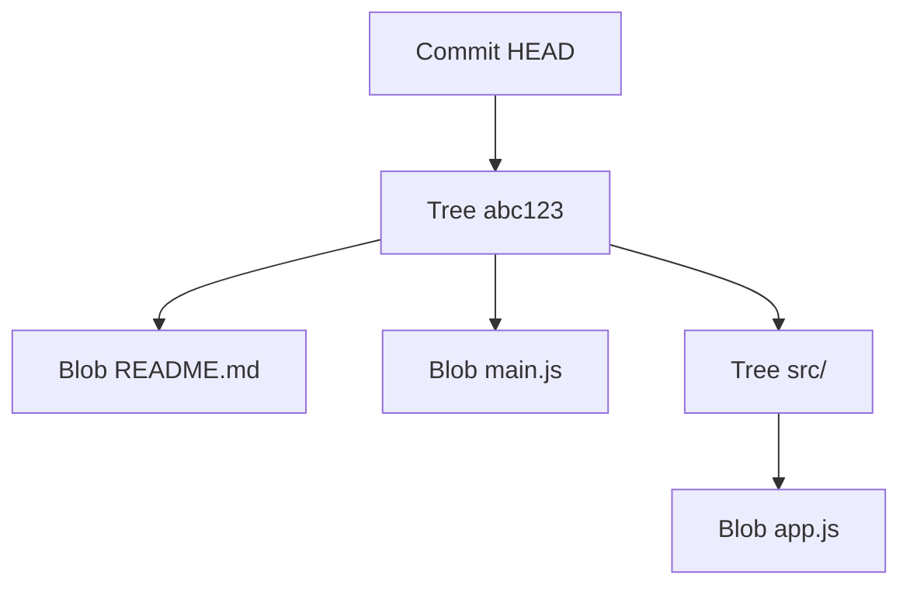
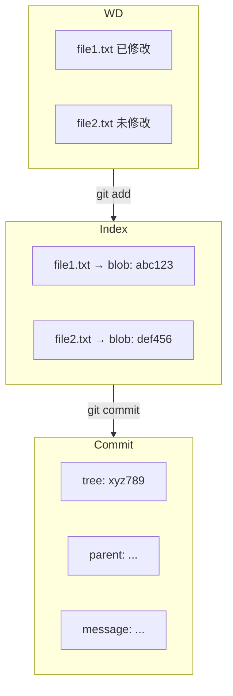
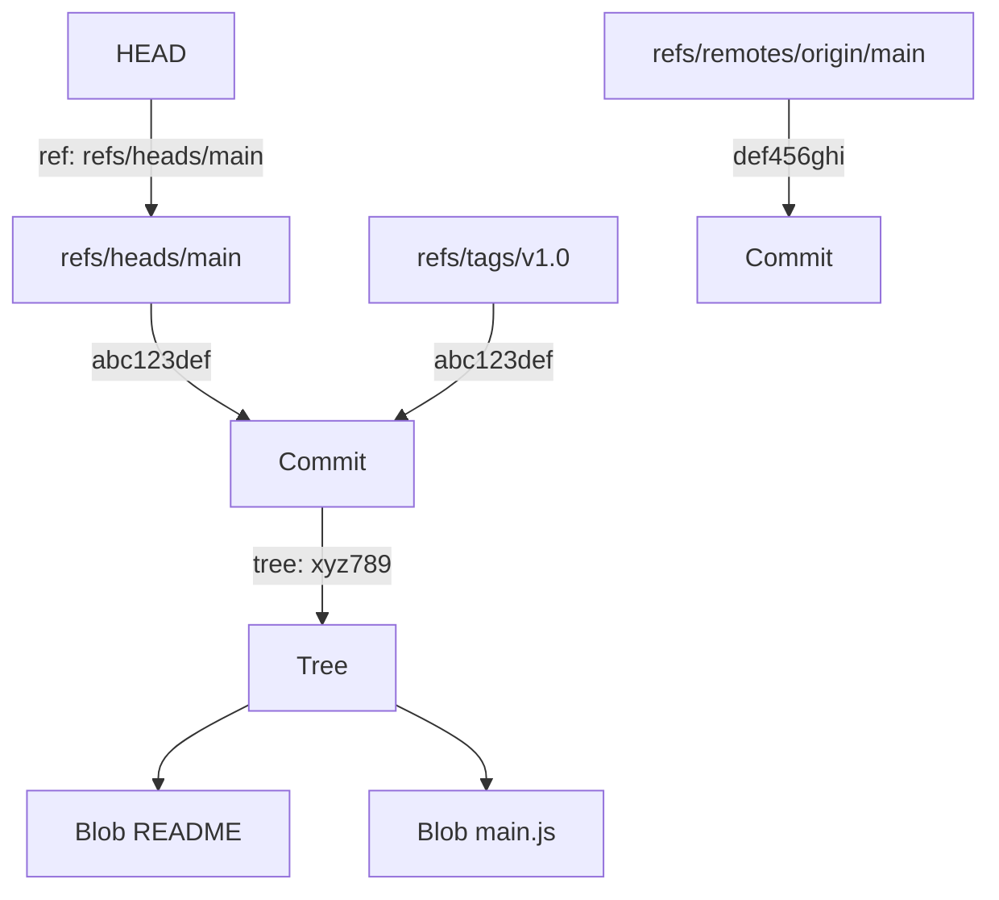
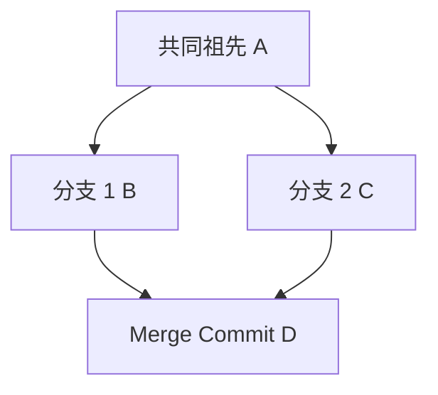
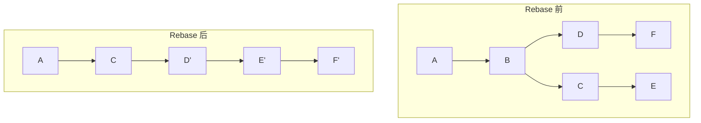
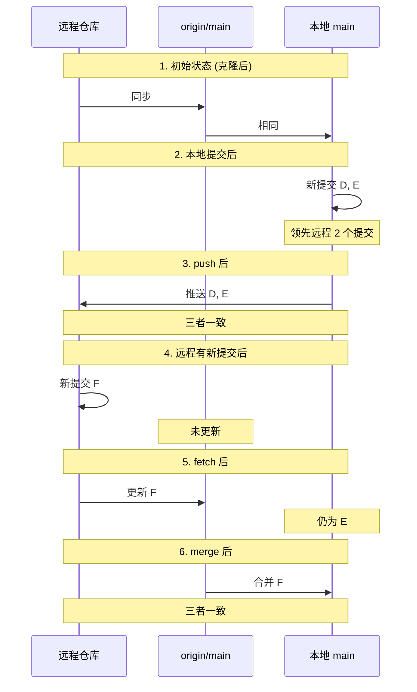

# Git 完全指南：从入门到精通的终极教程

> 本文基于 Git 2.50 版本，涵盖从基础命令到内部原理的完整知识体系，适合所有阶段的开发者阅读收藏。

---

## 目录

1. [Git 基础：五大核心命令](#1-git-基础五大核心命令)
2. [适用与不适用场景](#2-适用与不适用场景)
3. [GUI 工具与代码托管平台](#3-gui-工具与代码托管平台)
4. [分支管理完全手册](#4-分支管理完全手册)
5. [远程操作详解](#5-远程操作详解)
6. [高级技巧：暂存、撤销与变基](#6-高级技巧暂存撤销与变基)
7. [AI 辅助 Git 新时代](#7-ai-辅助-git-新时代)
8. [现代 Git 最佳实践](#8-现代-git-最佳实践)
9. [日常工作流与效率提升](#9-日常工作流与效率提升)
10. [Git 内部原理深度解析](#10-git-内部原理深度解析)

---

## 1. Git 基础：五大核心命令

### 1.1 初始化仓库

一切 Git 项目的起点，在指定目录创建版本控制仓库。

```bash
# 在当前目录初始化
git init

# 创建并初始化新目录
git init my-project
```

执行后会在目录中创建 `.git` 文件夹，包含所有版本控制信息。这个隐藏文件夹是 Git 仓库的核心，存储了所有的提交历史、分支信息和配置。

### 1.2 添加文件到暂存区

将工作区的更改添加到 Git 的暂存区（Index），为提交做准备。

```bash
# 添加所有更改
git add .

# 添加特定文件
git add app.js

# 添加多个文件
git add app.js styles.css

# 添加所有 txt 文件
git add *.txt
```

**进阶技巧**：使用 `git add -p` 可以交互式地选择要添加的更改部分，实现更精细的提交控制。

### 1.3 提交更改

将暂存区的更改永久保存到 Git 历史中。

```bash
# 基本提交
git commit -m "Initial commit"

# 跳过暂存区直接提交
git commit -am "Fix login bug"

# 修改最后一次提交
git commit --amend -m "Updated message"
```

**最佳实践**：推荐使用 Conventional Commits 格式，如 `feat: 添加新功能`、`fix: 修复登录 bug`，便于自动生成变更日志。

### 1.4 查看状态

查看工作区和暂存区的当前状态，了解哪些文件被修改、暂存或未跟踪。

```bash
# 查看详细状态
git status

# 查看简洁状态
git status -s

# 查看分支状态
git status -sb
```

Git 2.50 版本改进了状态显示的可读性，输出更加清晰直观。

### 1.5 查看历史

查看项目的提交历史记录，支持多种格式化选项。

```bash
# 查看完整历史
git log

# 查看简洁历史
git log --oneline

# 查看图形化历史
git log --graph --oneline

# 查看特定文件历史
git log --follow file.js
```

**提示**：按 `q` 退出日志查看器。现代 Git 日志输出更加美观和直观，支持彩色高亮。

---

## 2. 适用与不适用场景

### 2.1 Git 适用场景

#### 软件开发项目

Git 最核心的应用场景，管理源代码的版本迭代。

- ✅ Web 应用程序开发
- ✅ 移动应用开发
- ✅ 桌面应用开发
- ✅ 游戏开发
- ✅ API 服务开发

#### 文档与写作

协作写作和文档版本管理，追踪每次修改。

- ✅ 技术文档（Markdown、reStructuredText）
- ✅ 学术论文（LaTeX）
- ✅ 书籍写作
- ✅ 博客文章
- ✅ 法律合同文本

#### 配置文件管理

管理服务器配置、系统设置等文件的变更。

- ✅ 服务器配置文件
- ✅ Docker/Kubernetes 配置
- ✅ CI/CD 流水线配置
- ✅ 云基础设施代码（Terraform）
- ✅ 系统脚本和工具

#### 设计资源管理

管理设计文件和创意资源（配合 Git LFS）。

- ✅ UI 设计稿（SVG 格式）
- ✅ 字体文件
- ✅ 设计规范文档
- ✅ 品牌资产

#### 数据科学与研究

管理研究代码、实验配置和分析脚本。

- ✅ 数据分析脚本（Python/R）
- ✅ 机器学习模型代码
- ✅ 实验配置文件
- ✅ 研究项目代码
- ✅ 可复现性研究代码

#### 教育与学习

课程项目、学习笔记和教学材料的版本管理。

- ✅ 课程作业
- ✅ 学习笔记
- ✅ 教学课件
- ✅ 编程练习
- ✅ 开源学习项目

### 2.2 Git 不适用场景

#### 大型二进制文件

Git 不擅长处理大型二进制文件，会导致仓库体积膨胀。

- ❌ 高分辨率图片（RAW 格式）
- ❌ 视频文件（MP4、AVI 等）
- ❌ 音频文件（WAV、FLAC 等）
- ❌ 压缩包（ZIP、RAR、7z）
- ❌ 安装包（EXE、DMG、APK）

**建议**：使用 Git LFS、外部存储服务（AWS S3、阿里云 OSS）或专门的媒体管理系统。

#### 频繁变化的临时文件

临时文件、缓存文件等不需要版本控制的内容。

- ❌ 编译缓存（node_modules、.next）
- ❌ IDE 配置（.idea、.vscode 临时文件）
- ❌ 操作系统文件（.DS_Store、Thumbs.db）
- ❌ 日志文件（*.log）
- ❌ 数据库文件（SQLite、临时备份）

**建议**：使用 `.gitignore` 文件忽略这些文件。

#### 敏感与机密数据

绝不应该将敏感信息提交到 Git 仓库。

- ❌ API 密钥和访问令牌
- ❌ 数据库密码
- ❌ SSH 私钥
- ❌ SSL 证书
- ❌ 个人身份信息（PII）

**建议**：使用环境变量、密钥管理系统（HashiCorp Vault）或配置管理工具。

#### 实时协作的富媒体编辑

需要多人同时在线编辑的富媒体文档。

- ❌ 实时协作文档（Google Docs 风格）
- ❌ 复杂的 Excel 表格协作
- ❌ 在线白板绘图
- ❌ 视频剪辑项目
- ❌ 音频混音工程

**建议**：使用专门的协作工具（Google Docs、Notion、Figma、Miro 等）。

#### 极高频率的自动更新

每分钟甚至每秒都在变化的动态数据。

- ❌ 实时传感器数据
- ❌ 日志流（每秒写入）
- ❌ 交易记录
- ❌ 用户行为追踪数据
- ❌ 动态生成的报表

**建议**：使用数据库、时间序列数据库或日志收集系统。

#### 受版权限制的付费内容

有版权限制或需要许可证的文件。

- ❌ 付费字体文件
- ❌ 商业图片库素材
- ❌ 付费软件包
- ❌ 音乐版权文件
- ❌ 授权插件

**建议**：使用外部存储服务，在代码中引用而非包含文件本身。

#### 非结构化的大数据集

海量的非结构化数据不适合 Git 管理。

- ❌ 机器学习训练数据集（GB 级别）
- ❌ 数据库备份
- ❌ 影像库
- ❌ 备份归档
- ❌ 历史日志归档

**建议**：使用数据存储服务（HDFS、S3）、数据湖或专门的备份系统。

---

## 3. GUI 工具与代码托管平台

### 3.1 GUI 图形界面工具

#### Sourcetree

免费且功能强大的 Git 客户端，支持 Windows 和 Mac。

- ✅ 免费开源
- ✅ 中文界面支持
- ✅ Git Flow 可视化
- ✅ 内置 Diff 工具

下载地址：[sourcetreeapp.com](https://www.sourcetreeapp.com/)

#### GitKraken

现代化 Git 客户端，界面美观功能丰富。

- ✅ 跨平台支持
- ✅ 可视化分支图
- ✅ 内置代码编辑器
- ✅ 支持 GitHub/GitLab 集成

下载地址：[gitkraken.com](https://www.gitkraken.com/)

#### GitHub Desktop

GitHub 官方桌面客户端，专为 GitHub 用户设计。

- ✅ 简洁易用
- ✅ GitHub 深度集成
- ✅ Pull Request 支持
- ✅ 分支管理便捷

下载地址：[desktop.github.com](https://desktop.github.com/)

#### TortoiseGit

Windows 资源管理器集成型 Git 客户端。

- ✅ 右键菜单集成
- ✅ 无需离开资源管理器
- ✅ 中文界面支持
- ✅ 稳定可靠

下载地址：[tortoisegit.org](https://tortoisegit.org/)

#### lazygit

终端里的 Git UI 工具，轻量级且高效。

- ✅ 终端界面
- ✅ 键盘操作
- ✅ 资源占用极低
- ✅ 支持自定义

安装：`brew install lazygit`

### 3.2 国外代码托管平台

#### GitHub

全球最大的开源代码托管平台。

- ✅ 全球最大开源社区
- ✅ GitHub Actions CI/CD
- ✅ Pull Request 功能
- ✅ GitHub Pages 静态托管
- ✅ Copilot AI 编程助手
- ✅ GitHub Packages

官网：[github.com](https://github.com)

#### GitLab

一站式 DevOps 平台，支持自托管。

- ✅ 支持自托管部署
- ✅ 内置 CI/CD 流水线
- ✅ 代码审查功能强大
- ✅ 权限管理灵活
- ✅ GitLab Duo AI 助手
- ✅ Docker Registry

官网：[gitlab.com](https://gitlab.com)

#### Bitbucket

Atlassian 旗下的代码托管服务。

- ✅ 免费私有仓库
- ✅ Jira 集成
- ✅ Bitbucket Pipelines
- ✅ Azure DevOps 集成

官网：[bitbucket.org](https://bitbucket.org)

#### Azure DevOps

微软的企业级 DevOps 平台。

- ✅ Azure Repos 代码托管
- ✅ Azure Pipelines CI/CD
- ✅ Azure Boards 项目管理
- ✅ 企业级安全合规

官网：[azure.microsoft.com/services/devops/](https://azure.microsoft.com/services/devops/)

### 3.3 国内代码托管平台

#### Gitee (码云)

国内领先的代码托管平台，访问速度快。

- ✅ 国内访问速度最快
- ✅ 中文界面友好
- ✅ 私有仓库免费
- ✅ Gitee CI 持续集成
- ✅ 企业版支持

官网：[gitee.com](https://gitee.com)

#### GitCode

华为云提供的代码托管服务。

- ✅ 华为云背书
- ✅ 免费私有仓库
- ✅ CI/CD 流水线
- ✅ 项目管理功能
- ✅ 企业级安全

官网：[gitcode.com](https://gitcode.com)

#### 阿里云 Codeup

阿里云提供的企业级代码托管平台。

- ✅ 阿里云生态集成
- ✅ 企业级代码管理
- ✅ 代码检测能力
- ✅ 访问控制

官网：[codeup.aliyun.com](https://codeup.aliyun.com)

#### 腾讯云 Coding

腾讯云旗下的一站式 DevOps 平台。

- ✅ 腾讯云生态
- ✅ 免费私有仓库
- ✅ 持续集成/部署
- ✅ 项目管理

官网：[coding.net](https://coding.net)

### 3.4 自托管 Git 服务

#### Gogs

轻量级的自托管 Git 服务，完全开源免费。

- ✅ 极其轻量（资源占用少）
- ✅ 易于安装和配置
- ✅ 支持 MySQL、PostgreSQL、SQLite
- ✅ 中文界面
- ✅ 支持 Markdown 和 WiKi

GitHub：[gogs/gogs](https://github.com/gogs/gogs)

#### Gitea

Gogs 的社区 fork，功能更丰富。

- ✅ Gogs 的增强版
- ✅ 更多功能特性
- ✅ 活跃的社区支持
- ✅ 支持 Docker 部署
- ✅ LDAP/OAuth 认证

GitHub：[go-gitea/gitea](https://github.com/go-gitea/gitea)

#### GitLab CE/EE

GitLab 开源版，可完全自托管。

- ✅ 功能最全面
- ✅ 支持 Docker/K8s 部署
- ✅ 内置 CI/CD
- ✅ 权限管理完善
- ✅ 高可用架构

官网：[about.gitlab.com/install/](https://about.gitlab.com/install/)

#### Forgejo

从 Gitea 社区分叉的轻量级 Git 服务。

- ✅ Gitea 社区分叉
- ✅ 专注于简单易用
- ✅ 完全开源
- ✅ Docker 支持

官网：[forgejo.org](https://forgejo.org/)

#### 推荐部署方案

```
个人/小团队    → Gogs 或 Forgejo（轻量）
中等规模团队    → Gitea（功能丰富）
企业级需求      → GitLab CE/EE（功能全面）
```

**Docker 快速部署 Gitea**：

```bash
docker run -d --name gitea \
  -p 3000:3000 \
  -p 2222:22 \
  -v gitea:/data \
  gitea/gitea:latest
```

---

## 4. 分支管理完全手册

### 4.1 查看分支

```bash
# 查看本地分支
git branch

# 查看所有分支（包括远程）
git branch -a

# 查看远程分支
git branch -r

# 查看分支详细信息
git branch -vv
```

当前分支会显示星号 (*) 标记。

### 4.2 创建分支

```bash
# 创建新分支
git branch feature-login

# 从指定提交创建分支
git branch feature-login abc123

# 创建并切换到新分支
git checkout -b feature-login
```

**最佳实践**：推荐使用描述性的分支名，如 `feature/`、`bugfix/` 前缀。

### 4.3 切换分支

```bash
# 切换到分支
git checkout feature-login

# 使用 switch 命令（Git 2.23+）
git switch feature-login

# 切换到上一个分支
git checkout -
```

**提示**：确保当前工作区是干净的，或使用 `git stash` 保存未提交的更改。

### 4.4 合并分支

```bash
# 合并分支
git merge feature-login

# 禁用快进合并
git merge --no-ff feature-login

# 中断合并
git merge --abort
```

### 4.5 删除分支

```bash
# 删除已合并的分支
git branch -d feature-login

# 强制删除分支
git branch -D feature-login

# 删除远程分支
git push origin --delete feature-login
```

**注意**：`-d` 只删除已合并的分支，`-D` 可以删除未合并的分支（谨慎使用）。

---

## 5. 远程操作详解

### 5.1 添加远程仓库

```bash
# 添加 origin 远程仓库
git remote add origin https://github.com/user/repo.git

# 查看远程仓库
git remote -v

# 修改远程仓库 URL
git remote set-url origin https://github.com/user/new-repo.git
```

`origin` 是远程仓库的默认名称，可以自定义多个远程仓库。

### 5.2 克隆仓库

```bash
# 克隆到当前目录
git clone https://github.com/user/repo.git

# 克隆到指定目录
git clone https://github.com/user/repo.git my-project

# 克隆特定分支
git clone -b develop https://github.com/user/repo.git
```

克隆后会自动创建 `.git` 文件夹，并设置 `origin` 远程仓库。

### 5.3 推送代码

```bash
# 推送当前分支
git push origin main

# 推送并设置上游分支
git push -u origin main

# 推送所有分支
git push --all origin

# 强制推送（谨慎使用）
git push --force origin main
```

`-u` 参数设置上游分支后，后续只需执行 `git push`。

### 5.4 拉取代码

```bash
# 拉取当前分支
git pull origin main

# 拉取并变基
git pull --rebase origin main

# 只拉取不合并
git fetch origin main
```

`git pull` 等同于 `git fetch` + `git merge`。

### 5.5 获取更新

```bash
# 获取所有远程更新
git fetch

# 获取特定远程仓库
git fetch origin

# 获取特定分支
git fetch origin main
```

获取后可以查看差异再决定是否合并，这是更安全的工作方式。

---

## 6. 高级技巧：暂存、撤销与变基

### 6.1 暂存工作

临时保存当前工作区的更改，便于切换分支或处理紧急任务。

```bash
# 暂存当前更改
git stash

# 带消息暂存
git stash save "work in progress"

# 恢复最近暂存
git stash pop

# 查看暂存列表
git stash list
```

在切换分支前使用，避免未提交的更改造成冲突。

### 6.2 撤销提交

```bash
# 撤销最后一次提交但保留更改
git reset HEAD~1

# 撤销提交并删除更改
git reset --hard HEAD~1

# 修改最后一次提交
git commit --amend
```

**模式说明**：
- `--soft`：保留更改在暂存区
- `--mixed`：保留更改在工作区
- `--hard`：完全删除（谨慎使用）

### 6.3 变基操作

重新应用提交到另一个基础，线性化提交历史。

```bash
# 变基到 main 分支
git rebase main

# 交互式变基
git rebase -i HEAD~3

# 跳过变基
git rebase --skip

# 中止变基
git rebase --abort
```

### 6.4 选择提交

选择特定提交应用到当前分支。

```bash
# 选择单个提交
git cherry-pick abc123

# 选择多个提交
git cherry-pick abc123..def456

# 选择但不自动提交
git cherry-pick -n abc123
```

---

## 7. AI 辅助 Git 新时代

### 7.1 AI 生成提交信息

使用 AI 工具分析代码变更，生成符合规范的提交信息。

```bash
# GitHub Copilot CLI
git add .
git commit -m "$(gh copilot suggest '生成描述这些变更的提交信息')"

# Gitmoji AI 助手
git commit -m "$(gitmoji -ai)"

# 自定义 AI 脚本
git commit -m "$(python ai-commit-generator.py)"
```

AI 能够理解代码语义，生成符合 Conventional Commits 规范的提交信息。

### 7.2 AI 代码审查

使用 AI 分析 Pull Request，提供代码质量建议。

```bash
# GitHub Copilot 自动审查
# AI 会自动检测潜在的 bug、性能问题和安全漏洞

# GitLab Duo AI 审查
gitlab-duo review feature/new-ui

# 本地 AI 审查工具
ai-review --diff HEAD~1
```

AI 审查可以捕捉人工可能遗漏的问题，如未处理的边界条件、安全漏洞、性能优化机会等。

### 7.3 AI 冲突解决

AI 辅助理解和解决 Git 合并冲突。

```bash
# 使用 AI 理解冲突
git conflict explain

# AI 建议合并策略
git merge-suggest feature/new-ui

# AI 自动解决简单冲突
git resolve-conflict --ai file.js
```

现代 Git 工具已集成 AI，可以解释冲突上下文并建议最佳合并方案。

### 7.4 AI 命令预测

AI 根据上下文预测下一个 Git 命令。

```bash
# GitSense AI（假设的 AI 助手）
$ git [Tab]
# AI 提示：根据您的更改，可能需要：
#   git add modified-file.js
#   git commit -m "fix: 修复登录验证逻辑"
#   git push origin feature/login

# 配置 shell 集成
eval "$(git-predict init)"
```

AI 命令预测基于项目历史和个人使用模式，学习您的习惯并提供个性化建议。

---

## 8. 现代 Git 最佳实践

### 8.1 GPG 签名验证

使用 GPG/SSH 密钥签名提交，验证作者身份。

```bash
# 配置 GPG 签名
git config --global commit.gpgsign true
git config --global gpg.program gpg2

# 查看签名状态
git log --show-signature

# 使用 SSH 签名
git config --global commit.gpgsign true
git config --global gpg.format ssh
```

主流平台（GitHub/GitLab）推荐使用签名验证提交，提高代码可信度。

### 8.2 Conventional Commits

遵循规范化的提交信息格式。

```bash
# 格式：type(scope): subject
git commit -m "feat(auth): 添加 OAuth2 登录支持"
git commit -m "fix(api): 修复用户数据获取 bug"
git commit -m "docs(readme): 更新安装说明"
git commit -m "style(button): 优化按钮样式"

# 安装 commitlint
npm install @commitlint/cli @commitlint/config-conventional
```

使用 commitlint 工具自动验证提交信息格式，便于自动生成变更日志。

### 8.3 Partial Clone

部分克隆大型仓库，节省时间和空间。

```bash
# 按需克隆（不下载历史）
git clone --filter=blob:none https://github.com/user/repo.git

# 仅克隆特定分支
git clone --single-branch --branch main repo.git

# 克隆特定文件
git clone --depth 1 --filter=blob:limit=1m repo.git
```

对于包含大型媒体文件或历史的仓库，部分克隆可提速 90% 以上。

### 8.4 Sparse Checkout

只检出仓库的特定目录，适用于 monorepo 项目。

```bash
# 启用稀疏检出
git clone --no-checkout repo.git
cd repo
git sparse-checkout init
git sparse-checkout set src/api docs

# 添加更多目录
git sparse-checkout add src/components

# 禁用稀疏检出
git sparse-checkout disable
```

### 8.5 性能优化

```bash
# 启用并行索引操作
git config --global core.parallelIndex 8

# 优化大文件处理
git lfs install
git lfs track "*.psd"

# 使用 Git 2.50+ 的新索引格式
git update-index --index-version 4

# 清理无用文件
git gc --prune=now
```

---

## 9. 日常工作流与效率提升

### 9.1 标准开发流程

```bash
# 1. 拉取最新代码
git pull origin main

# 2. 创建功能分支
git checkout -b feature/new-feature

# 3. 开发并查看状态
git status

# 4. 添加更改到暂存区
git add .

# 5. 提交代码
git commit -m "feat: 添加新功能"

# 6. 推送到远程
git push -u origin feature/new-feature

# 7. 创建 Pull Request/Merge Request
```

**提交前检查**：

```bash
# 查看将要提交的更改
git diff --cached

# 查看未暂存的更改
git diff
```

### 9.2 修复 Bug 流程

```bash
# 1. 从 main 创建 bug 修复分支
git checkout main
git pull origin main
git checkout -b bugfix/login-error

# 2. 定位问题提交
git log --oneline --all
git bisect start
git bisect bad HEAD
git bisect good v1.0.0

# 3. 修复代码并提交
git add .
git commit -m "fix: 修复登录验证错误"

# 4. 推送并创建 PR
git push -u origin bugfix/login-error
```

**查看变更历史**：

```bash
# 查看文件变更历史
git log --follow -p filename.js

# 查看谁在什么时候修改的
git blame filename.js
```

### 9.3 紧急修复流程

```bash
# 1. 基于生产标签创建 hotfix 分支
git checkout -b hotfix/critical-bug v1.0.0

# 2. 快速修复问题
git add .
git commit -m "hotfix: 修复生产环境严重错误"

# 3. 打补丁标签
git tag -a v1.0.1 -m "Hotfix patch"

# 4. 合并回 main 和 develop
git checkout main
git merge --no-ff hotfix/critical-bug
git tag v1.0.1

# 5. 推送所有
git push origin main --tags
```

### 9.4 常用别名配置

```bash
# 设置别名
git config --global alias.st status
git config --global alias.co checkout
git config --global alias.br branch
git config --global alias.ci commit
git config --global alias.unstage 'reset HEAD --'
git config --global alias.last 'log -1 HEAD'
git config --global alias.lg "log --color --graph --pretty=format:'%Cred%h%Creset -%C(yellow)%d%Creset %s %Cgreen(%cr) %C(bold blue)<%an>%Creset' --abbrev-commit"

# 使用别名
git st
git co feature/login
git br -a
git ci -m "fix bug"
git lg
```

### 9.5 忽略文件配置

```gitignore
# .gitignore 示例

# 依赖目录
node_modules/
vendor/

# 编译输出
dist/
build/
*.min.js

# 环境配置
.env
.env.local

# IDE 配置
.vscode/
.idea/

# 日志文件
*.log
npm-debug.log*

# 操作系统文件
.DS_Store
Thumbs.db

# 忽略所有 .txt 文件
*.txt

# 但保留 important.txt
!important.txt
```

**常用命令**：

```bash
# 查看已被忽略的文件
git ls-files --others --ignored --exclude-standard

# 从版本控制中移除已跟踪文件（保留本地）
git rm --cached filename

# 移除目录下所有已跟踪文件
git rm -r --cached directory/
```

---

## 10. Git 内部原理深度解析

### 10.1 存储结构

深入了解 Git 的底层存储架构和目录结构。

```
.git/
├── HEAD                 # 当前分支引用
├── config               # 仓库配置文件
├── description          # 仓库描述
├── hooks/               # Git 钩子脚本
│   ├── pre-commit
│   ├── post-commit
│   └── ...
├── info/                # 排除文件
│   └── exclude
├── objects/             # Git 对象存储
│   ├── info/            # 包文件信息
│   │   └── packs
│   └── pack/            # 压缩包文件
│       ├── pack-*.idx   # 索引文件
│       └── pack-*.pack  # 数据文件
└── refs/                # 引用存储
    ├── heads/           # 本地分支
    │   ├── main
    │   └── develop
    ├── tags/            # 标签
    │   ├── v1.0.0
    │   └── v1.1.0
    └── remotes/         # 远程引用
        └── origin/
            ├── main
            └── develop
```

**核心目录详解**：

- `objects/` - 存储所有 Git 对象，使用前 2 位哈希作为目录名，剩余 38 位作为文件名
- `refs/` - 存储分支、标签等引用，内容是 commit 哈希
- `HEAD` - 指向当前分支的符号引用
- `index` - 暂存区二进制文件（隐藏）
- `config` - 仓库特定配置（用户名、邮箱、远程仓库等）
- `hooks/` - 自定义脚本，在特定 Git 操作时自动执行

**查看内部结构**：

```bash
# 查看 objects 目录
ls -la .git/objects/

# 查看 HEAD 内容
cat .git/HEAD

# 查看分支引用
cat .git/refs/heads/main

# 查看所有对象
git rev-list --all --objects

# 查看对象大小
git count-objects -vH
```

### 10.2 对象模型

Git 的四种核心对象类型及其作用。

#### 四种 Git 对象

1. **Blob 对象** - 存储文件内容
   - 文件内容被压缩并计算 SHA-1 哈希
   - 相同内容只存储一次（去重）
   - 不包含文件名、路径等信息

2. **Tree 对象** - 类似目录
   - 记录文件名、权限和 blob/tree 引用
   - 递归形成文件系统树
   - 一个 tree 可以包含 blob 和其他 tree

3. **Commit 对象** - 提交记录
   - 包含：tree 引用、父 commit、作者、时间、消息
   - 形成提交链（DAG - 有向无环图）

4. **Tag 对象** - 标签
   - 指向特定 commit，包含签名和消息
   - 用于版本标记，可以是轻量级或带注释

#### 对象关系图



#### 查看对象

```bash
# 查看对象类型
git cat-file -t <hash>

# 查看对象内容
git cat-file -p <hash>

# 查看对象大小
git cat-file -s <hash>

# 查看所有对象
git rev-list --all --objects
```

#### 哈希计算原理

```
对象哈希 = SHA1("type size\0content")

示例：内容为"hello"的 blob 对象
Header: "blob 5\0hello"
SHA1("blob 5\0hello") = a0423896b8...

这保证：
- 相同内容 = 相同哈希
- 不同类型 = 不同哈希
```

### 10.3 索引机制

理解暂存区（index）的工作原理。

#### 什么是索引

索引（Index）是一个二进制文件，位于 `.git/index`，记录了暂存区的文件信息。它是工作区和提交之间的桥梁。

#### 索引结构图



#### git add 原理

```bash
# git add 执行流程：

# 1. 读取工作区文件内容
# 2. 计算内容的 SHA-1 哈希
# 3. 在 objects 目录中查找该哈希
# 4. 如果对象不存在，创建 blob 对象并存储
# 5. 更新索引，添加/更新文件条目

# 这就是为什么"添加"很快：
# - 内容未变则复用已有对象
# - 只更新索引，不立即提交
# - 增量更新，不复制整个文件
```

#### 索引状态

文件的三种状态：

1. **未跟踪 (untracked)** - 新文件，从未被 add
2. **已暂存 (staged)** - 在索引中，等待提交
3. **已修改 (modified)** - 工作区与索引不一致

### 10.4 引用机制

理解 Git 如何通过引用定位对象和分支。

#### 引用类型

```bash
# 1. HEAD - 当前分支引用
# .git/HEAD 内容：ref: refs/heads/main

# 2. 分支引用 - refs/heads/
# .git/refs/heads/main 内容：abc123... (commit 哈希)

# 3. 远程引用 - refs/remotes/
# .git/refs/remotes/origin/main 内容：def456...

# 4. 标签引用 - refs/tags/
# .git/refs/tags/v1.0 内容：789abc...

# 5. 特殊引用 - refs/stash, refs/original/*
```

#### 引用关系图



#### 查看引用

```bash
# 查看所有引用
git show-ref

# 查看特定引用
git show-ref heads/main

# 查看 HEAD 指向
git symbolic-ref HEAD

# 查看引用日志
git reflog show main

# 解析引用到 commit
git rev-parse main
```

#### Detached HEAD 状态

当 HEAD 直接指向 commit 而非分支引用时，称为 detached HEAD 状态。

```bash
# 进入 detached HEAD 状态
git checkout abc123def

# 查看当前 HEAD 状态
cat .git/HEAD

# 从 detached 状态恢复
git checkout main

# 在 detached 状态下创建新分支
git checkout -b new-branch
```

### 10.5 命令原理

深入理解常用 Git 命令的底层实现。

#### git commit 原理

```bash
# 执行步骤：
# 1. 基于索引创建 tree 对象
# 2. 读取当前 HEAD 获取父 commit
# 3. 创建 commit 对象（包含 tree、父 commit、作者、消息）
# 4. 计算 commit 对象的 SHA-1 哈希
# 5. 更新当前分支引用指向新 commit
```

#### git merge 原理

```bash
# 执行步骤：
# 1. 找到两个分支的共同祖先（LCA）
# 2. 比较分支与祖先的差异（三方差异）
# 3. 使用祖先作为基准进行三方合并
# 4. 如果无冲突，创建 merge commit（两个父 commit）
```

#### 三方合并示意图



#### git checkout 原理

```bash
# 执行步骤：
# 1. 更新 HEAD 引用指向目标分支
# 2. 读取目标 commit 的 tree 对象
# 3. 递归遍历 tree，用 blob 更新工作区文件
# 4. 更新索引匹配新的 tree
# 5. 删除工作区中不存在于新 tree 的文件

# checkout 本质是：更新 HEAD + 恢复工作区 + 更新索引
```

#### git rebase 原理

```bash
# 执行步骤：
# 1. 找到当前分支和目标分支的共同祖先
# 2. 提取当前分支从祖先开始的所有 commit
# 3. 暂存这些 commit 的变更
# 4. 将当前分支重置到目标分支
# 5. 在目标分支上依次重新应用每个 commit
# 6. 为每个 commit 创建新的 commit（新哈希）
```

#### rebase 示意图



### 10.6 Git 比较算法

#### Myers 差异算法

Git 使用 Myers 差异算法来计算两个文本之间的最小编辑序列。

**算法核心思想**：通过构建一个编辑图（Edit Graph），寻找从起点到终点的最短路径。每条路径代表一种编辑操作（插入、删除、匹配）。

**时间复杂度**：
- 最坏情况：O(ND)
- N = 文件 A 的行数
- D = 最小编辑距离
- 实际应用中：通常接近 O(N+M)

#### Patience Diff 算法

Git 2.11+ 引入的另一种 diff 算法，在某些场景下比 Myers 算法更符合人类直觉。

**算法原理**：寻找文件中"独特且有序"的共同行（unique common elements），作为锚点进行匹配。

**适用场景**：
- ✅ 函数或代码块重新排序
- ✅ 大量相似的重复代码
- ✅ 结构性重构

#### Histogram Diff 算法

Git 默认的 diff 算法，结合了 Myers 和 Patience 的优点，使用直方图统计来优化匹配。

**算法特点**：
1. 统计每行出现的次数（直方图）
2. 优先匹配出现次数少的行（更可能是锚点）
3. 在锚点之间使用 Myers 算法
4. 对锚点附近的行进行局部优化

#### diff 算法对比

| 算法 | 速度 | 准确性 | 可读性 | 使用场景 |
|------|------|--------|--------|----------|
| Myers | ★★★☆☆ | ★★★★☆ | ★★★☆☆ | 通用，Git 默认 |
| Patience | ★★☆☆☆ | ★★★★★ | ★★★★★ | 代码重排 |
| Histogram | ★★★★☆ | ★★★★☆ | ★★★★☆ | 现代 Git 默认 |
| Minimal | ★☆☆☆☆ | ★★★★★ | ★★★☆☆ | 精确分析 |

#### 切换 diff 算法

```bash
# 使用 Patience diff
git diff --patience

# 使用 Histogram diff（默认）
git diff --histogram

# 使用 Myers diff
git diff --minimal

# 全局配置默认算法
git config --global diff.algorithm histogram
```

### 10.7 分支合并原理

#### 合并基础概念

Git 合并的核心是找到共同祖先（Common Ancestor），然后进行三方合并（3-way merge）。

#### 三方合并算法

Git 使用递归三方合并（Recursive 3-way merge）算法，这是最常用的合并策略。

**合并步骤**：
1. 找到两个分支的共同祖先（LCA）
2. 比较 祖先→分支 1 的变更（diff1）
3. 比较 祖先→分支 2 的变更（diff2）
4. 逐文件合并：
   - 如果只在 diff1 中修改 → 采用 diff1
   - 如果只在 diff2 中修改 → 采用 diff2
   - 如果都修改了同一行 → 产生冲突
   - 如果都修改了不同行 → 自动合并
5. 创建 merge commit（两个父 commit）

#### 合并策略类型

| 策略 | 命令 | 描述 | 适用场景 |
|------|------|------|----------|
| recursive | `git merge` | 递归三方合并（默认） | 大多数场景 |
| resolve | `-s resolve` | 简单的三方合并 | 快速合并，冲突少 |
| octopus | 自动选择 | 合并多个分支 | 合并 3+ 分支 |
| ours | `-s ours` | 保留当前分支 | 丢弃其他分支 |
| subtree | `-s subtree` | 子树合并 | 子模块替代 |

#### 冲突解决原理

当两个分支修改了同一行内容时，Git 无法自动决定采用哪个版本，产生冲突。

**冲突标记格式**：
```
<<<<<<< HEAD (当前分支的修改)
当前分支的内容
======= (分隔符)
合并分支的内容
>>>>>>> feature (合并分支的修改)
```

**解决冲突后运行**：
```bash
git add <file>
git commit
```

#### 快进合并 (Fast-forward)

当目标分支是当前分支的直接后继时，可以使用快进合并。

```bash
# 允许快进合并（默认）
git merge feature

# 禁用快进合并
git merge --no-ff feature

# 仅快进合并
git merge --ff-only feature
```

### 10.8 本地与远程分支关系

#### 远程分支概念

远程分支（remote branch）是远程仓库状态的本地引用，存储在 `refs/remotes/` 目录下。

**远程分支特点**：
1. **只读引用** - 不能直接修改，通过 fetch/push 更新
2. **缓存远程状态** - 反映上次 fetch 时的远程状态，不是实时同步的
3. **独立于本地分支** - origin/main ≠ main，它们是独立的 commit 引用

#### 远程分支存储结构

```
.git/refs/remotes/
└── origin/
    ├── main          (远程 main 分支)
    ├── develop       (远程 develop 分支)
    ├── feature/login (远程 feature/login 分支)
    └── HEAD          (默认分支引用)
```

#### 本地分支与远程分支的映射

本地分支和远程分支通过"上游分支"（upstream）概念建立关联。

**上游分支设置**：

```bash
# 设置上游分支（首次 push）
git push -u origin main
# 等同于：
git push origin main
git branch --set-upstream-to=origin/main main

# 查看上游分支
git branch -vv

# 修改上游分支
git branch --set-upstream-to=origin/develop main
```

**本地分支配置（.git/config）**：
```ini
[branch "main"]
    remote = origin
    merge = refs/heads/main
```

这表示：
- 本地 main 分支跟踪 origin 远程仓库
- 合并目标是 origin/main 分支

#### 分支关系示意图



#### fetch 更新机制

`git fetch` 从远程仓库获取最新数据，更新远程分支引用。

**fetch 执行过程**：
1. 连接到远程仓库
2. 获取远程的引用列表
3. 下载缺失的对象（commits, trees, blobs）
4. 更新 refs/remotes/* 引用
5. 不修改工作区和本地分支

```bash
# 获取所有远程更新
git fetch

# 获取特定远程仓库
git fetch origin

# 获取特定分支
git fetch origin main

# 获取所有远程仓库
git fetch --all

# 获取并修剪已删除的远程分支
git fetch --prune
```

#### push 同步机制

`git push` 将本地提交推送到远程仓库，更新远程分支。

**push 执行过程**：
1. 打包本地 objects（增量）
2. 发送到远程仓库
3. 远程验证（权限、快进检查）
4. 更新远程引用
5. 触发远程 hooks（如果配置）

```bash
# 推送当前分支到上游
git push

# 推送指定分支
git push origin main

# 推送并设置上游
git push -u origin feature

# 推送所有分支
git push --all

# 推送标签
git push --tags

# 强制推送（谨慎使用）
git push --force-with-lease  # 比较安全
```

#### pull 合并机制

`git pull` 是 `git fetch` 和 `git merge` 的组合。

```bash
# git pull = git fetch + git merge

# 1. git fetch origin
#    - 更新 refs/remotes/origin/*
# 2. git merge origin/main
#    - 合并远程更新到当前分支

# git pull --rebase = git fetch + git rebase
# - 先 fetch，然后 rebase 当前分支
```

#### 分支追踪关系查看

```bash
# 查看分支和上游关系
git branch -vv

# 输出示例：
# * main    abc123 [origin/main: ahead 2, behind 1] Add feature
#   develop def456 [origin/develop] Update code
#   feature ghi789 [origin/feature: gone] Old feature

# 含义：
# - ahead 2: 本地领先远程 2 个提交
# - behind 1: 本地落后远程 1 个提交
# - gone: 远程分支已被删除

# 查看远程分支详情
git remote show origin

# 查看本地和远程的差异
git log HEAD..origin/main
```

#### 远程分支删除与清理

```bash
# 删除远程分支
git push origin --delete feature
# 或
git push origin :feature

# 删除本地已删除的远程分支引用
git fetch --prune
# 或
git remote prune origin

# 查看已删除的远程分支引用
git branch -r --merged
git branch -r --no-merged
```

#### 多远程仓库管理

一个本地仓库可以关联多个远程仓库。

```bash
# 添加多个远程仓库
git remote add origin https://github.com/user/repo.git
git remote add upstream https://github.com/original/repo.git
git remote add fork https://github.com/fork/repo.git

# 查看所有远程仓库
git remote -v

# 从不同远程拉取
git fetch origin
git fetch upstream

# 推送到不同远程
git push origin main
git push fork feature

# 删除远程仓库
git remote remove fork
```

**常用场景：Fork 项目**
- `origin`: 自己的 fork 仓库
- `upstream`: 原始项目仓库
- 定期从 upstream 获取更新，推送到 origin

#### 远程分支同步最佳实践

```bash
# 1. 定期获取更新
git fetch --all --prune

# 2. 查看状态再操作
git status
git branch -vv

# 3. 使用 rebase 保持历史整洁
git pull --rebase

# 4. 推送前先拉取
git pull --rebase origin main
git push origin main

# 5. 谨慎使用强制推送
git push --force-with-lease  # 比较安全
# 而不是
git push --force  # 危险
```

---

## 结语

Git 作为现代软件开发的核心工具，其功能之强大、应用之广泛远超想象。从基础的初始化仓库到复杂的内部原理，从命令行操作到 AI 辅助，本文涵盖了 Git 知识体系的方方面面。

**学习建议**：
1. **初学者**：先掌握基础五大命令，熟悉日常工作流
2. **进阶者**：深入学习分支管理和远程操作，理解合并与变基的区别
3. **高级用户**：研究内部原理，理解对象模型和索引机制，能够解决复杂问题

**持续学习**：
- 关注 Git 官方发布的新版本特性
- 尝试新的 GUI 工具和 AI 辅助功能
- 参与开源项目，实践协作开发流程

Git 不仅是一个版本控制工具，更是现代软件开发协作的基础设施。掌握 Git，让你的开发工作更加高效、有序！

---

**参考资料**：
- Git 官方文档：https://git-scm.com/docs
- Pro Git 书籍：https://git-scm.com/book/zh/v2
- GitHub 学习实验室：https://github.com/skills

**版本信息**：本文基于 Git 2.50 版本编写，部分新特性可能需要较新版本的 Git 支持。

---

*如果觉得本文有帮助，欢迎点赞、收藏、转发！*
